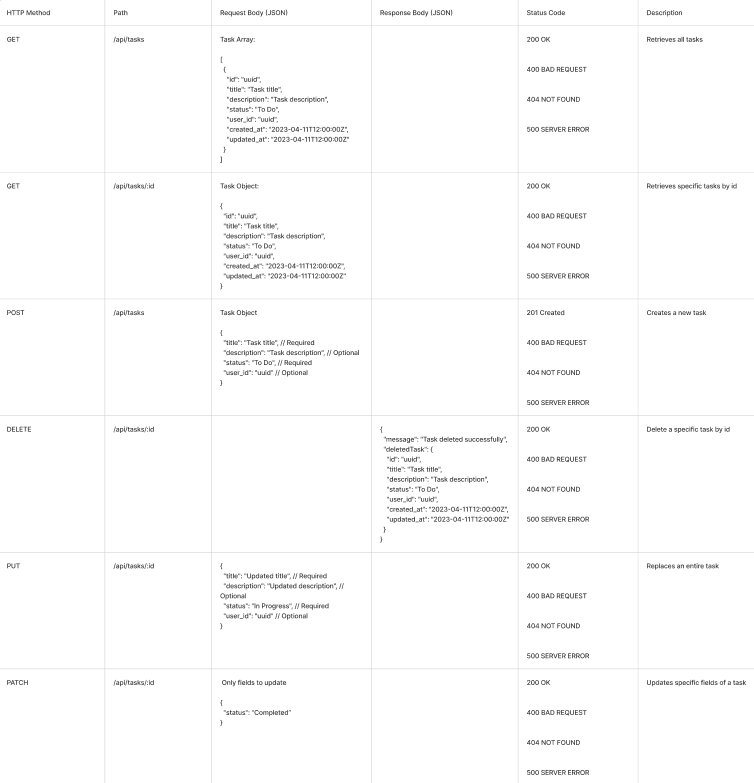
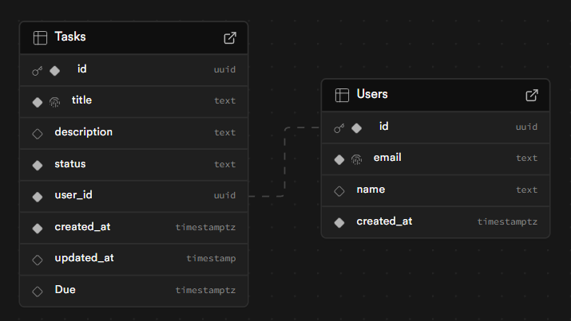

# $${\color{#e8a71a}DTS Challenge}$$ 


## Contents
* [Overview](#overview)
* [Screenshots](#screenshots)
* [Process](#the-process)
* [Built With](#built-with)
* [Learning](#learning)
* [Continued development](#continued-development)

## Overview
This Task Management System addresses the challenge of developing an application that enables efficient task tracking. The system should provide a REST API backend and frontend interface that allows users to create, view, update, and delete tasks with properties including title, description, status, and due dates. The implementation should follow best practices with comprehensive testing, database integration, validation, error handling, and documented API endpoints..

## Screenshots




## Commands
- install in both front and backend folders (cd backend/ cd frontend)
```npm i ```

- run
```npm run dev```

-test
```npm run test```
```npm run test:ui```
```npm run test:coverage```

## Set up your own .env file:
In Backend add your SUPABASE_URL and SUPABASE_KEY to a .env file and gitignore.

**For assessment please email me for the key.

### Create Tasks Table
create table public."Tasks" (
  id uuid not null default extensions.uuid_generate_v4 (),
  title text not null,
  description text null,
  status text not null,
  user_id uuid not null default extensions.uuid_generate_v4 (),
  created_at timestamp with time zone not null default now(),
  updated_at timestamp without time zone null,
  "Due" timestamp with time zone null,
  constraint Tasks_pkey primary key (id),
  constraint Tasks_title_key unique (title),
  constraint Tasks_user_id_fkey foreign KEY (user_id) references "Users" (id)
) TABLESPACE pg_default;

### Create Users Table
create table public."Users" (
  id uuid not null default extensions.uuid_generate_v4 (),
  email text not null,
  name text null,
  created_at timestamp with time zone not null default now(),
  constraint Users_pkey primary key (id),
  constraint Users_email_key unique (email)
) TABLESPACE pg_default;


## The Process
Picking the stack:
Backend Technology Choice: Node.js & Express
Why Node.js & Express:
- Good at handling lots of connections at once.
- Express is great for building REST APIs with simple routing.
- Makes it easy to add middleware for things like error handling.
- Can test the API on its own without the frontend.
- Keeps frontend and backend code separate which feels cleaner.
  
Both approaches share these benefits:
- Can use JavaScript everywhere which means less context switching.
- Tonnes of npm packages available to help build features.
- TypeScript works well with both.
- Similar testing approaches.
  
What Next.js offers:
- Everything in one place (frontend and backend together).
- Simpler to deploy as one app.
- API routes built right in.
- I chose Node.js with Express because I wanted to try a different approach after using Next.js before, and I liked the idea of having a separate backend and frontend.

Database Choice: Supabase
- Generous free tier with no time limit.
- Ready to use auth features if needed.
- Built on PostgreSQL - reliable, powerful queries.
- Realtime updates if needed.
- Intuitive dashboard.
- I have some familiarity with it.

Testing suite choice: Vitest
- Fast and comprehensive.
- Have experience using it.

Front-End Choice: Next.js
- Has built in routing.
- Better performance with Server-side Rendering (also SEO).
- Easier to connect to back end with built in data fetching.
- A lot comes out of the box (Typescript, error boundaries).

### Built with
- Node.js
- Express
- Supabase
- Vite

### Learning


### Continued development

### Useful resources

